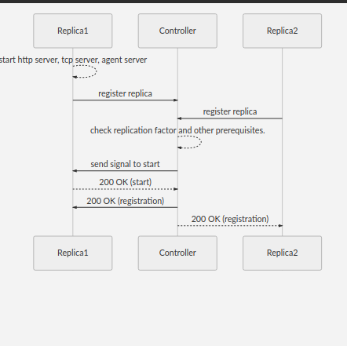

## Sequence diagram

### Replica Registration



**Note:**
 
 - If 1 or more than replica is already added to the controller, other restarted replicas will not go through registration process, it will directly jump to add replica call. Check code at sync/sync.go for more details.
    ```
    func (t *Task) AddReplica(replicaAddress string, s *replica.Server) error {
    ........ skipped .........
    Register:
		logrus.Infof("Get Volume info from controller")
		volume, err := t.client.GetVolume()
		if err != nil {
			return fmt.Errorf("failed to get volume info, error: %s", err.Error())
		}
		addr := strings.Split(replicaAddress, "://")
		parts := strings.Split(addr[1], ":")
		if volume.ReplicaCount == 0 {
			revisionCount := Replica.GetRevisionCounter()
			replicaType := "Backend"
			upTime := time.Since(Replica.ReplicaStartTime)
			state, _ := server.PrevStatus()
			logrus.Infof("Register replica at controller")
			err := t.client.Register(parts[0], revisionCount, replicaType, upTime, string(state))
			if err != nil {
				logrus.Errorf("Error in sending register command, error: %s", err)
			}
			select {
			case <-ticker.C:
				logrus.Info("Timed out waiting for response from controller, will retry")
				goto Register
			case action = <-replica.ActionChannel:
			}
		}
		if action == "start" {
			logrus.Infof("Received start from controller")
			types.ShouldPunchHoles = true
			if err := t.client.Start(replicaAddress); err != nil {
				types.ShouldPunchHoles = false
				return err
			}
			return nil
		}
	
		logrus.Infof("Adding replica %s in WO mode", replicaAddress)
		// Preload doesn't need to be called yet as no read IO will be served until
		// sync is completed
		s.SetPreload(false)
		_, err = t.client.CreateReplica(replicaAddress)
	........ skipped .........
    ```
